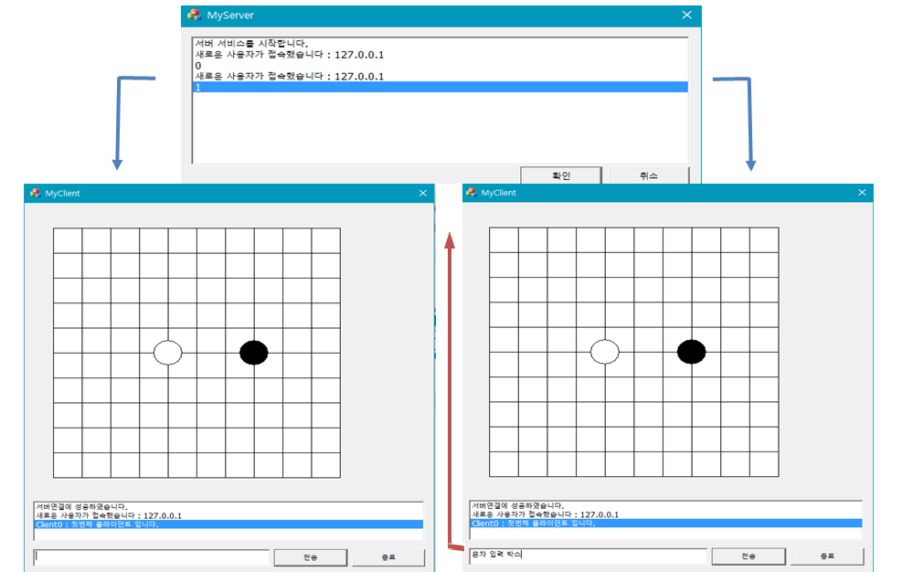
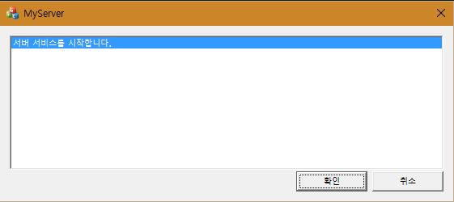
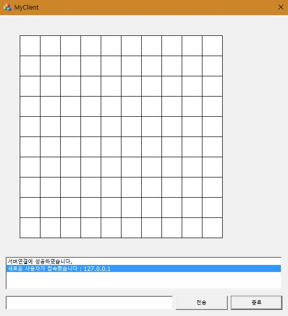

# 프로젝트 명 : Gomoku
* MFC 소켓 네트워크 오목 게임

## 개발 환경
* Visual Studio 2015

## 프로젝트 선정 배경
* MFC프로그래밍과 소켓 프로그래밍을 이론으로 공부했던 내용을 실습해보는 것에 목적이 있다.
 또한 운영체제에서 배웠던 쓰레드, 비동기식을 응용해봄으로써 활용방법에 대해 알아본다.

## 프로젝트 설명
* 서버 프로그램에 클라이언트가 접속해 클라이언트끼리 오목, 채팅을 하는 게임이다.
* 최대 두명의 클라이언트가 연결 가능하며 먼저 접속한 클라이언트가 검정돌을 가지게 된다.
* 화면을 클릭하며 오목돌이 그려지고 채팅을 입력하고 전송버튼을 누르면 대화 내용을 전달해준다. 
* 소켓을 이용해 TCP 통신을 하며 서버 프로그램은 쓰레드, 클라이언트 프로그램은 비동기식을 사용했다.
* 서버와 클라이언트 둘 다 MFC로 구현되었다. 

##미리보기
* 전체 실행 화면

    
    
* 서버 프로그램

    

* 클라이언트 프로그램

    
